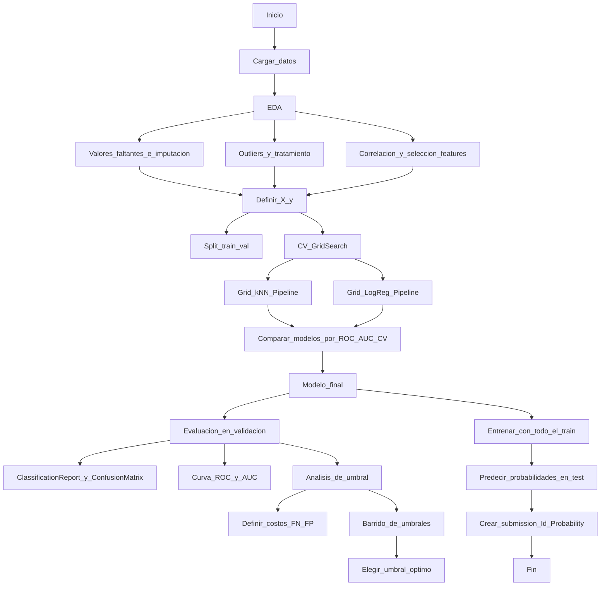

# Diagrama del pipeline — Proyecto 1 (Riesgo Crediticio)

Este diagrama resume el flujo completo implementado en el notebook central `notebook/proyecto_1.ipynb`.

```mermaid
flowchart TD
  A[Inicio] --> B[Cargar_datos]
  B --> C[EDA]
  C --> C1[Valores_faltantes_e_imputacion]
  C --> C2[Outliers_y_tratamiento]
  C --> C3[Correlacion_y_seleccion_features]

  C1 --> D[Definir_X_y]
  C2 --> D
  C3 --> D

  D --> E[Split_train_val]
  D --> F[CV_GridSearch]

  F --> F1[Grid_kNN_Pipeline]
  F --> F2[Grid_LogReg_Pipeline]
  F1 --> G[Comparar_modelos_por_ROC_AUC_CV]
  F2 --> G

  G --> H[Modelo_final]
  H --> I[Evaluacion_en_validacion]
  I --> I1[ClassificationReport_y_ConfusionMatrix]
  I --> I2[Curva_ROC_y_AUC]

  I --> J[Analisis_de_umbral]
  J --> J1[Definir_costos_FN_FP]
  J --> J2[Barrido_de_umbrales]
  J2 --> J3[Elegir_umbral_optimo]

  H --> K[Entrenar_con_todo_el_train]
  K --> L[Predecir_probabilidades_en_test]
  L --> M[Crear_submission_Id_Probability]
  M --> N[Fin]
```

